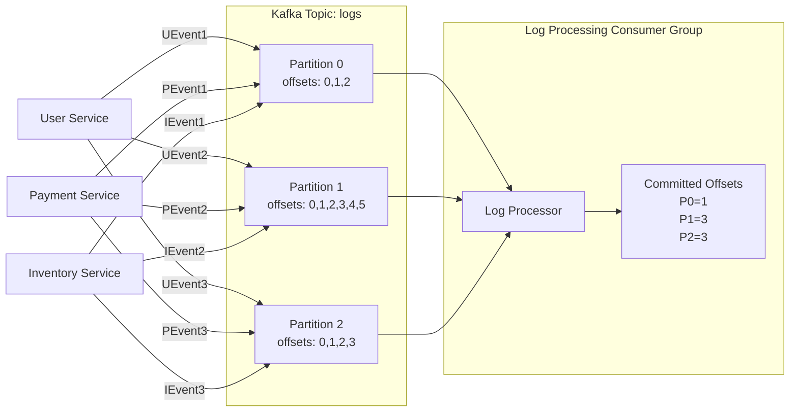
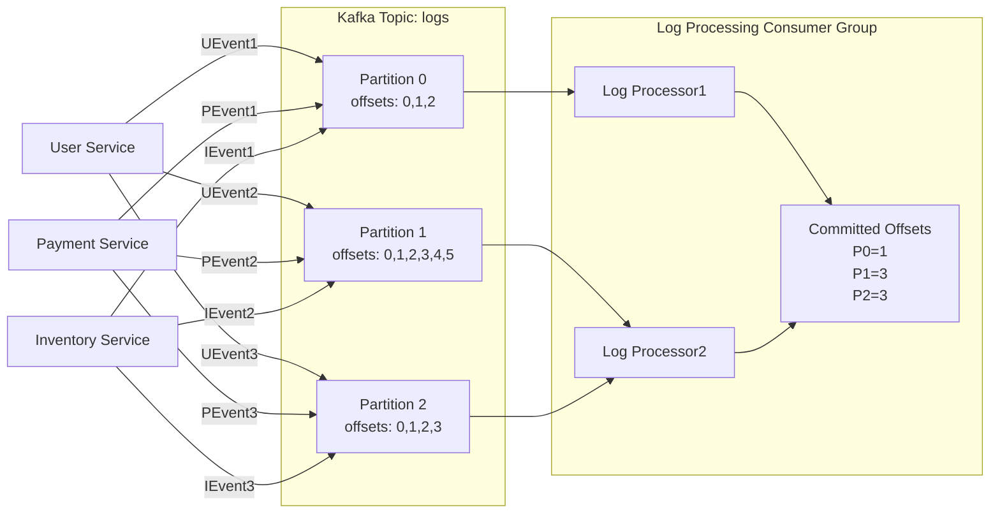

# Zadatak: Streaming logova iz mikroservisa

```mermaid
flowchart LR

    S1[User Service]
    S2[Payment Service]
    S3[Inventory Service]

    subgraph Kafka Topic: logs
        P0["Partition 0
            offsets: 0,1,2"]
        P1["Partition 1
            offsets: 0,1,2,3,4,5"]
        P2["Partition 2
            offsets: 0,1,2,3"]
    end

    S1 -->|"UEvent1"| P0
    S1 -->|"UEvent2"| P1
    S1 -->|"UEvent3"| P2

    S2 -->|"PEvent1"| P0
    S2 -->|"PEvent2"| P1
    S2 -->|"PEvent3"| P2

    S3 -->|"IEvent1"| P0
    S3 -->|"IEvent2"| P1
    S3 -->|"IEvent3"| P2

    subgraph Log Processing Consumer Group
        C1[Log Processor]
        LogOff["Committed Offsets<br/>P0=1<br/>P1=3<br/>P2=3"]
    end

    P0 --> C1
    P1 --> C1
    P2 --> C1
    C1 --> LogOff
```

## Povećanje broja pristiglih logova

## Slučaj kad jedan consumer padne

```mermaid
flowchart LR

    S1[User Service]
    S2[Payment Service]
    S3[Inventory Service]

    subgraph Kafka Topic: logs
        P0["Partition 0
            offsets: 0,1,2"]
        P1["Partition 1
            offsets: 0,1,2,3,4,5"]
        P2["Partition 2
            offsets: 0,1,2,3"]
    end

    S1 -->|"UEvent1"| P0
    S1 -->|"UEvent2"| P1
    S1 -->|"UEvent3"| P2

    S2 -->|"PEvent1"| P0
    S2 -->|"PEvent2"| P1
    S2 -->|"PEvent3"| P2

    S3 -->|"IEvent1"| P0
    S3 -->|"IEvent2"| P1
    S3 -->|"IEvent3"| P2

    subgraph Log Processing Consumer Group
        C1[Log Processor1]
        C2[Log Processor2]
        LogOff["Committed Offsets<br/>P0=1<br/>P1=3<br/>P2=3"]
    end

    P0 --> C1
    P1 --> C2
    P2 --> C2
    C1 --> LogOff
    C2 --> LogOff
```
